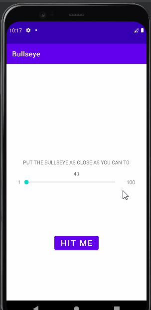

# Some-mini-mobile-project_Kotlin-XML

A learning simple Android Kotlin app.  
Each time it will create a random target value, and you should drag the slider to as near as possible that target value.  

<!-- Thanks to Kodeco and Okiche -->
